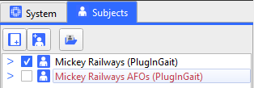
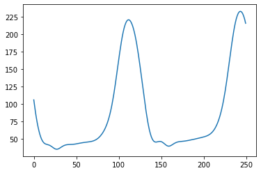

# Gait-Laboratory 
A repository for managing Gait Lab projects involving common coding challenges. For example\:

- Python interacting with Vicon Nexus
- Microcontroller language projects
    - C++
    - Arduino

This private repository can be used as a common starting point for project development, to control versions of in-house projects, and collaborate on project development with colleagues.
The access to this repository is currently managed by [Alex S](mailto:alex.skondras@gstt.nhs.uk?subject=[GitHub]%20Source%20%Gait20Laboratory) with scope to move to a GitHub oraganisation structure in future.

---
## Python in Vicon Nexus
## 1. Importing the ViconNexus module

On Trust machines, include the following code at the start of a Python script to define the system paths required to import the ViconNexus library:

```python
# Define file locations of ViconNexus library files
viconPaths = [
  #OLD LAPTOPS
  'C:/Program Files (x86)/Vicon/Nexus2.11/SDK/Python',
  'C:/Program Files (x86)/Vicon/Nexus2.11/SDK/Win64',
  #NEW LAPTOPS (21H2 build)
  'C:/Program Files/Vicon/Nexus2.15/Python',
  'C:/Program Files/Vicon/Nexus2.15/SDK/Win64/Python/viconnexusapi',
  'C:/Program Files/Vicon/Nexus2.15/SDK/Win64/Python/viconnexusapi/viconnexusapi',
  # For Nexus 2.16 (Lab PC)
  'C:/Program Files/Vicon/Nexus2.16/Python',
  'C:/Program Files/Vicon/Nexus2.16/SDK/Win64/Python/viconnexusapi',
  'C:/Program Files/Vicon/Nexus2.16/SDK/Win64/Python/viconnexusapi/viconnexusapi'
  ]

# Add file paths to PYTHONPATH variable
for path in viconPaths:
    sys.path.append(path)

# Import library
import ViconNexus

# Create instance of ViconNexus object
vicon = ViconNexus.ViconNexus()
```

## 2. ViconNexus built-in functions

The ViconNexus library includes a variety of built-in functions, which can execute tasks in Nexus to extract and manipulate data. To view the full list of built-in functions, run the following command in a Python console:

*Input:*

```python
dir(vicon)
```

*Output:*

```
['ClearAllEvents',
 'Client',
 'CloseTrial',
 'Connect',
 'CreateAnEvent',
 'CreateAnalysisParam',
 'CreateModelOutput',
 'CreateModeledMarker',
 'CreateSubjectParam',
 '...']
```

To display more information on any of the built-in functions, run the following command in a Python console, using the format *help*(*vicon.FunctionName):*

*Input (e.g. to show help on ‘CreateAnEvent’) :*

```python
help(vicon.CreateAnEvent)
```

*Output:*

```
Help on method CreateAnEvent in module ViconNexus:

CreateAnEvent(subject, context, event, frame, offset) method of ViconNexus.ViconNexus 
instance
    Create a new event at the specifed ( frame + offset )
    
    Input
      subject     = string, name of an existing subject
      context     = string, name of the context. Valid values are: Left, Right, General
      event      = string, name of the event %*type*. Valid values are: Foot Strike, 
      Foot Off, General
      frame      = integer value, trial frame number as displayed in the application
      time bar
	    offset     = double value, offset (in seconds) from the beginning of the frame to
	    the event occurrence. The value should be in the range of 0.00 to 1/FrameRate
    
    Usage Example:
    
     vicon.CreateAnEvent('Patricia', 'Foot Strike', 'Left', 137, 0.0)
```

## 3. Quickstart guide to some useful tasks

### 3.1 Get Nexus subject information

This example will demonstrate how information relating to Nexus subject files associated with a trial can be extracted. In the case below, two subjects have been created within a Nexus session:



By running the following command, we can extract the subjects’ information:

*Input:*

```python
vicon.GetSubjectInfo()
```

*Output:*

```
(['Mickey Railways', 'Mickey Railways AFOs],
 ['PlugInGait', 'PlugInGait'],
 [True, False])
```

We see the result is a tuple of size 3, with each element corresponding to each subject’s name, labelling template, and status respectively. 

<aside>
💡

**USEFUL EXAMPLE**

Use the following lines to retrieve and print only the name of the currently active subject (the one that’s ticked in Nexus):

*Input:*

```python
names,_,active = vicon.GetSubjectInfo()
subject = str([name for name,status in zip(names,active) if status == True][0])
print(subject)
```

*Output:*

```
'Mickey Railways'
```

</aside>

### 3.2 Reading marker trajectories

Marker trajectories can be extracted from a trial in Nexus using command *vicon.GetTrajectory(subject,markerName).* Here, the *subject* argument must be a string containing the name of the corresponding subject created in Nexus. The *markerName* argument must be a string containing the 4 letter label assigned to the marker in Nexus (e.g. ‘LHEE’). For example:

*Input:*

```python
vicon.GetTrajectory('Mickey Railways','LHEE')
```

The result is a tuple of length 4. The first element contains the *x* coordinate of the LHEE marker at each frame within the trial. The second and third elements contain the *y* and *z* coordinates respectively. The fourth element contains a boolean value of whether the marker of interest is visible in the corresponding frame. 

*Note: using this command alone, the trajectory will be read across the entire trial, regardless of whether it has been cropped in Nexus.*

<aside>
💡

**USEFUL EXAMPLE**

Use the following lines to extract the region of interest from a trial in Nexus, then to read and plot the trajectory of the left heel marker within the region of interest in the *z* direction:

*Input:*

```python
>import matplotlib.pyplot as plt

frameRoi = vicon.GetTrialRegionOfInterest()
traj = vicon.GetTrajectory('Mickey Railways','LHEE')
trajZ = traj[2]
croppedTrajZ = trajZ[frameRoi[0]-1:frameRoi[-1]-1]
plt.plot(croppedTrajZ)
```

*Output:*



</aside>

### 3.3 Reading analog data


---
## Microcontroller projects
Info
### Arduino projects
### C++
---
## Repository Working Rules
