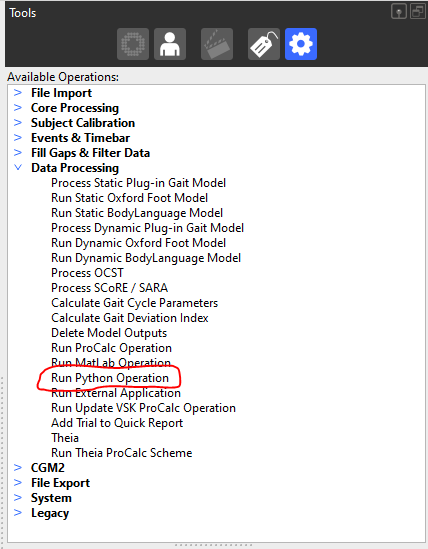
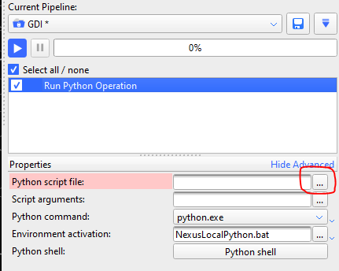
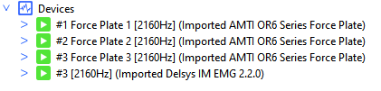
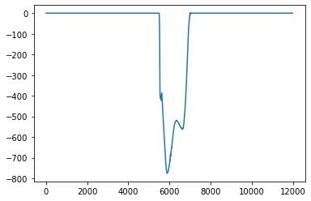
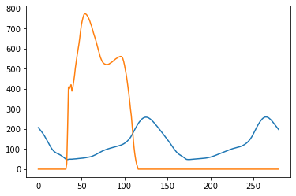

# Gait-Laboratory 
A repository for managing Gait Lab projects involving common coding challenges. For example\:

- Python interacting with Vicon Nexus
- Microcontroller language projects
    - C++
    - Arduino

This private repository can be used as a common starting point for project development, to control versions of in-house projects, and collaborate on project development with colleagues.
The access to this repository is currently managed by [Alex S](mailto:alex.skondras@gstt.nhs.uk?subject=[GitHub]%20Source%20%Gait20Laboratory) with scope to move to a GitHub organisation structure in future.

Quickstart Guide
---
## Python in Vicon Nexus

Each install of Vicon Nexus includes a version of Python. Vicon also provide a Nexus Python API and library of Python functions, meaning that Python scripts can be used to interact with and manipulate data within Nexus. The following sections provide guide to getting up and running executing Python scripts with Nexus, a brief overview of the functionality of the Python Nexus library, and some example use cases to help get started.

## 1. How to run Python scripts

### 1.1 Within Nexus
Python commands can be executed within Nexus in a few ways. 

Firstly, the Python shell can be used to run single commands. This is accessed via the 'Python' tab in Eclipse, and opening the Python shell (see below).


Secondly, a Python script written in an external editor (such as Notepad, or an IDE such as Spyder) can be run as part of a pipeline within Nexus. To do this, add a 'Data Processing/Run Python Operation' step to the pipeline, selecting the Python script to run by clicking the 3 dots to the side of 'Python Script File' (see below).

&nbsp;&nbsp;&nbsp;&nbsp;&nbsp;&nbsp;


### 1.2 Using an external IDE (recommended)
Scripts can also be executed in an external IDE (such as Spyder), provided that a trial is open within Nexus at the same time. Commands that are run within the IDE interact whichever trial is open in Nexus at that time.

The use of an external IDE is recommended for ease of debugging code, and when batch processing trials and exporting outputs to a seperate file format (such as an Excel sheet, .csv file, etc.)

## 2. Importing the ViconNexus module

On Trust machines, include the following code at the start of a Python script to define the system paths required to import the ViconNexus library:

```python
# Define file locations of ViconNexus library files
viconPaths = [
  # For Nexus 2.11 (shouldn't be needed)
  'C:/Program Files (x86)/Vicon/Nexus2.11/SDK/Python',
  'C:/Program Files (x86)/Vicon/Nexus2.11/SDK/Win64',
  # For Nexus 2.15 (all shared laptops/desktops)
  'C:/Program Files/Vicon/Nexus2.15/Python',
  'C:/Program Files/Vicon/Nexus2.15/SDK/Win64/Python/viconnexusapi',
  'C:/Program Files/Vicon/Nexus2.15/SDK/Win64/Python/viconnexusapi/viconnexusapi',
  # For Nexus 2.16 (Lab PC)
  'C:/Program Files/Vicon/Nexus2.16/Python',
  'C:/Program Files/Vicon/Nexus2.16/SDK/Win64/Python/viconnexusapi',
  'C:/Program Files/Vicon/Nexus2.16/SDK/Win64/Python/viconnexusapi/viconnexusapi'
  ]

# Add file paths to PYTHONPATH variable
for path in viconPaths:
    sys.path.append(path)

# Import library
import ViconNexus

# Create instance of ViconNexus object
vicon = ViconNexus.ViconNexus()
```

## 3. ViconNexus built-in functions

The ViconNexus library includes a variety of built-in functions, which can execute tasks in Nexus to extract and manipulate data. To view the full list of built-in functions, run the following command in a Python console:

*Input:*

```python
dir(vicon)
```

*Output:*

```
['ClearAllEvents',
 'Client',
 'CloseTrial',
 'Connect',
 'CreateAnEvent',
 'CreateAnalysisParam',
 'CreateModelOutput',
 'CreateModeledMarker',
 'CreateSubjectParam',
 '...']
```

To display more information on any of the built-in functions, run the following command in a Python console, using the format *help*(*vicon.FunctionName):*

*Input (e.g. to show help on ‘CreateAnEvent’) :*

```python
help(vicon.CreateAnEvent)
```

*Output:*

```
Help on method CreateAnEvent in module ViconNexus:

CreateAnEvent(subject, context, event, frame, offset) method of ViconNexus.ViconNexus 
instance
    Create a new event at the specifed ( frame + offset )
    
    Input
      subject     = string, name of an existing subject
      context     = string, name of the context. Valid values are: Left, Right, General
      event      = string, name of the event %*type*. Valid values are: Foot Strike, 
      Foot Off, General
      frame      = integer value, trial frame number as displayed in the application
      time bar
	    offset     = double value, offset (in seconds) from the beginning of the frame to
	    the event occurrence. The value should be in the range of 0.00 to 1/FrameRate
    
    Usage Example:
    
     vicon.CreateAnEvent('Patricia', 'Foot Strike', 'Left', 137, 0.0)
```

## 4. Quickstart guide to some useful tasks

### 4.1 Get Nexus subject information

This example will demonstrate how information relating to Nexus subject files associated with a trial can be extracted. In the case below, two subjects have been created within a Nexus session:


By running the following command, we can extract the subjects’ information:

*Input:*

```python
vicon.GetSubjectInfo()
```

*Output:*

```
(['Mickey Railways', 'Mickey Railways AFOs],
 ['PlugInGait', 'PlugInGait'],
 [True, False])
```

We see the result is a tuple of size 3, with each element corresponding to each subject’s name, labelling template, and status respectively. 

<br>
<aside>
💡

**USEFUL EXAMPLE**

Use the following lines to retrieve and print only the name of the currently active subject (the one that’s ticked in Nexus):

*Input:*

```python
names,_,active = vicon.GetSubjectInfo()
subject = str([name for name,status in zip(names,active) if status == True][0])
print(subject)
```

*Output:*

```
'Mickey Railways'
```

</aside>
<br>

### 4.2 Reading marker trajectories

Marker trajectories can be extracted from a trial in Nexus using the command *vicon.GetTrajectory(subject,markerName).* Here, the *subject* argument must be a string containing the name of the corresponding subject created in Nexus. The *markerName* argument must be a string containing the 4 letter label assigned to the marker in Nexus (e.g. ‘LHEE’). For example:

*Input:*

```python
vicon.GetTrajectory('Mickey Railways','LHEE')
```

The result is a tuple of length 4. The first element contains the *x* coordinate of the LHEE marker at each frame within the trial. The second and third elements contain the *y* and *z* coordinates respectively. The fourth element contains a boolean value of whether the marker of interest is visible in the corresponding frame. 

*Note: by using this command alone the trajectory will be read across the entire trial, regardless of whether it has been cropped in Nexus.*

<br>
<aside>
💡 
	
**USEFUL EXAMPLE**

Use the following lines to extract the region of interest from a trial in Nexus, then to read and plot the trajectory in the *z* direction of the left heel marker within the region of interest:

*Input:*

```python
import matplotlib.pyplot as plt

frameRoi = vicon.GetTrialRegionOfInterest()
traj = vicon.GetTrajectory('Mickey Railways','LHEE')
trajZ = traj[2]
croppedTrajZ = trajZ[frameRoi[0]-1:frameRoi[-1]-1]
plt.plot(croppedTrajZ)
```

*Output:*


<br>

### 4.3 Reading analog data

This example will demonstrate how to read in analog device data from Nexus. 

Here, we have a trial containing force plate and EMG data.



Each analog device inside a trial is given a unique ID. These can be accessed using the command *vicon.GetDeviceIDs()*.

*Input:*

```python
deviceIDs = vicon.GetDeviceIDs()
print(deviceIDs)
```

*Output:*

```
[1, 2, 3, 6]
```

Details about each device can be accessed using these IDs, with the command *vicon.GetDeviceDetails(deviceID)*.

*Input:*

```python
fp1Details = vicon.GetDeviceDetails(1) # (ID of force plate 1)
print(fp1Details)
```

*Output:*

```
('Force Plate 1', # Name
 'ForcePlate', # Device Type
 2160.0, # Sampling rate
 [1, 2, 3, 4], # Output IDs
 <viconnexusapi.NexusForcePlate.NexusForcePlate at 0x1b8bc8a3d90>, # Additional info if the device is a forceplate
 <viconnexusapi.NexusEyeTracker.NexusEyeTracker at 0x1b8bcc51d60>) # Additional info if the device is an eyetracker
```

Each device may have several outputs (as seen by expanding them in Nexus). In the example above, force plate 1 has the outputs 'Force','Moment','CoP', and 'Raw'. These outputs each have an associated ID (shown in the output of the above example). Details of each output can be accessed with the command *vicon.GetDeviceDetails(deviceID,outputID)*.

*Input:*

```python
fp1ForceDetails = vicon.GetDeviceOutputDetails(1,1) # (ID of force plate 1, ID of the 'Force' output)
print(fp1ForceDetails)
```

*Output:*

```
('Force', # Output name
 'Force', # Output type
 'newton', # Unit name
 True, # Indication of whether the device is in the 'ready' state
 ['Fx', 'Fy', 'Fz'], # Channel names associated with the output
 [1, 2, 3]) # Channel IDs associated with the output
```

Finally, each device output may have several output channels. In this example, the 'Force' output from force plate 1 has the channels 'Fx', 'Fy', 'Fz', with associated channel IDs (shown in the output above). The data from each channel is read as below:

*Input:*

```python
fp1Fz, ready, rate = vicon.GetDeviceChannel(1,1,3) # (ID of force plate 1, ID of the 'Force' output, ID of the 'Fz' channel)
plot(fp1Fz)
print('Ready status: ', ready)
print('Sampling rate: ',rate)
```

*Output:*



```
Ready status:  True
Sampling rate:  2160.0
```

<br>
<aside>
💡 
	
**USEFUL EXAMPLE**
Read and plot the Fz output of force plate 1 (derived in the above example) overlayed on the 'LHEE' marker trajectory (derived in a previous example) 

*Note: The sampling rate of the most analog devices in Nexus is higher than that of the Vicon cameras (usually 2160Hz, as compared to 120Hz). Because of this, each data point within camera data will correspond to 2160/120 = 18 data points in analog data.*

*Input*
```python
cameraRate = vicon.GetFrameRate() # Read camera sampling rate
_,_,analogRate,_,_,_ = vicon.GetDeviceDetails(1) # Read force plate 1 sampling rate
convRate = int(analogRate/cameraRate) # Conversion between sampling rates of cameras and analog devices

croppedTrajZ = trajZ[frameRoi[0]-1:frameRoi[-1]-1] # LHEE trajectory from previous example, cropped to Nexus region of interest
croppedfp1Fz = fp1Fz[(frameRoi[0]-1)*convRate:(frameRoi[-1]-1)*convRate] # Fz channel of force plate 1 from previous example, cropped to Nexus region of interest, and differences in sampling rate accounted for
downsampledfp1Fz = croppedfp1Fz[::convRate] # Downsampled force plate data, only taking every 18th value

plt.plot(croppedTrajZ)
plt.plot([val*-1 for val in downsampledfp1Fz]) # Plot positive force plate data
```

*Output:*



<!---
your comment goes here
and here
---
## Microcontroller projects
Info
### Arduino projects
### C++
---
## Repository Working Rules
-->
